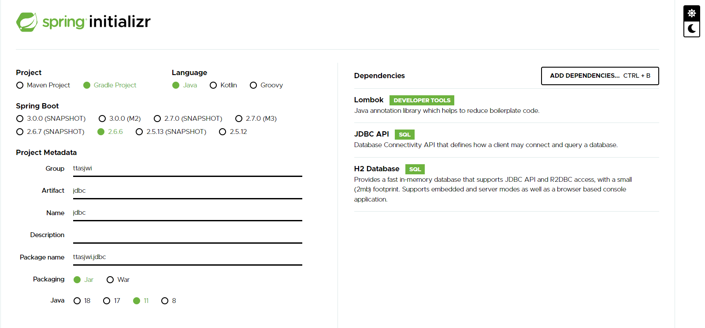
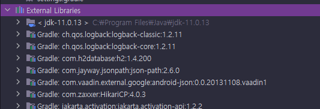
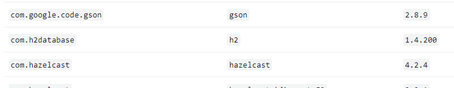
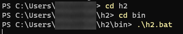
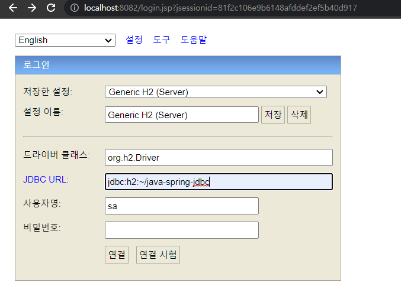
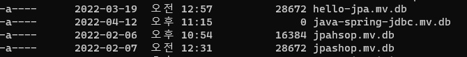
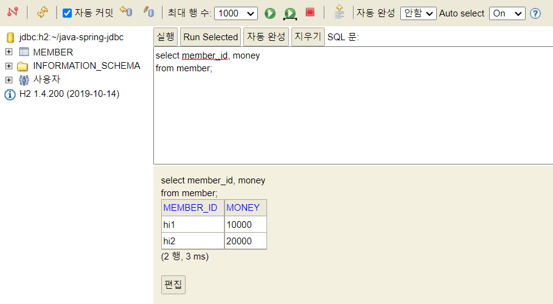
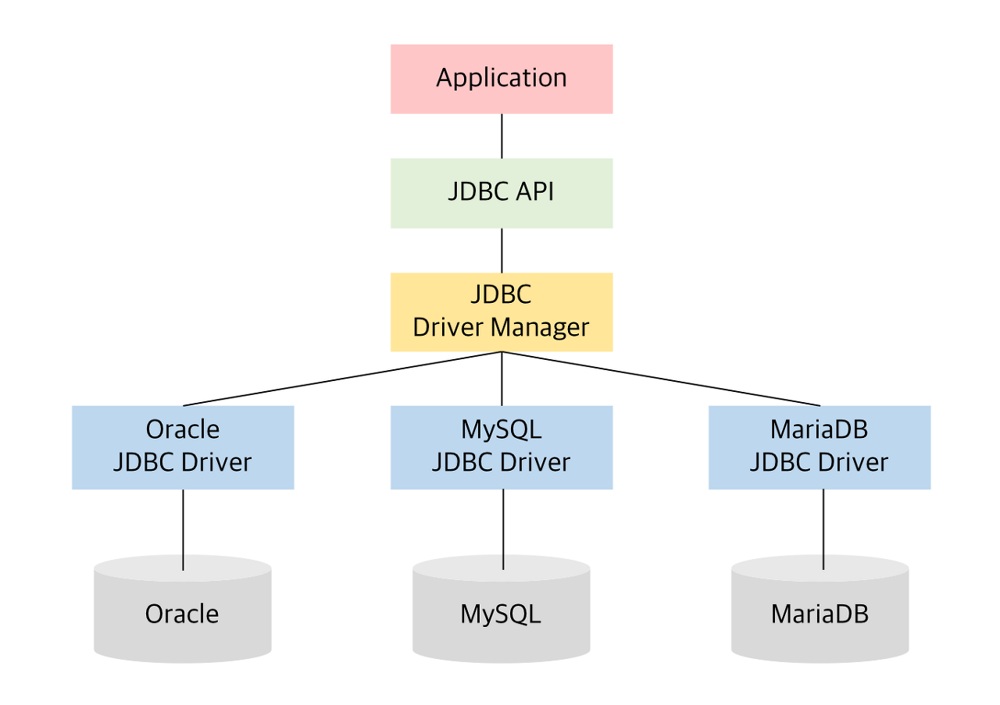
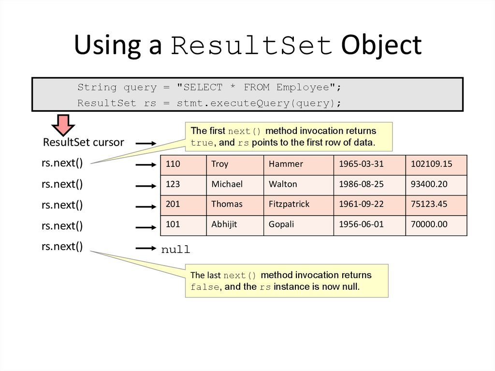

# java-spring-jdbc

우아한형제들 김영한 님의 인프런 강의 '스프링 DB 1편 - 데이터 접근 핵심 원리'을 수강하면서 정리하기 위한 레포지토리

---

## 프로젝트 초기 설정

<details>
<summary>접기/펼치기 버튼</summary>
<div markdown="1">

### start.spring.io

아래의 설정 후 Generate를 클릭 > 압축파일 받아짐 > 풀기 > 인텔리제이에서 해당 폴더의 build.gradle 선택해서 프로젝트 빌드
- Project : Gradle Project
- Language: java
- Spring Boot : 2.6.6 (뒤에 괄호가 붙지 않은 가장 최신 버전을 사용)
- Project Metadata
  - Group
  - Artifact, Name
  - Package name : 자동적으로 `Group.Name`으로 작성됨
  - Packaging : Jar
  - Java : 11

### Dependencies
- Lombok
- JDBC API
- H2 Database : Driver Manager

### build.gradle 설정
```groovy
//테스트에서 lombok 사용
testCompileOnly 'org.projectlombok:lombok'
testAnnotationProcessor 'org.projectlombok:lombok'
```
- Dependencies에 추가 (테스트 코드에서 Logger 사용 목적)
- 인텔리제이 우측 상단의 gradle > Reload All Gradle Projects

### H2 데이터베이스 설치



- [h2 홈페이지](https://www.h2database.com/html/main.html) > All Downloads > Archive Downloads
- 스프링부트에서 지원하는 버전을 확인하고 적절한 버전을 사용
  - 2022.04.12 기준으로 스프링부트에서 지원하는 버전은 1.4.200 [[링크](https://docs.spring.io/spring-boot/docs/current/reference/html/dependency-versions.html#appendix.dependency-versions)]
    - 확인방법 : [Spring 공식 페이지](https://spring.io/) - Projects - [Spring Boot](https://spring.io/projects/spring-boot) - Learn - 현재 버전의 [Reference Doc](https://docs.spring.io/spring-boot/docs/current/reference/html/) > [Dependency Versions](https://docs.spring.io/spring-boot/docs/current/reference/html/dependency-versions.html#appendix.dependency-versions)

### H2 데이터베이스 실행




- 압축을 풀고, `h2>bin` 폴더에 들어간다.
- h2 실행 쉘 스크립트를 실행한다.
  - windows : `.\h2.bat`을 입력하여 실행
  - mac/linux : `chmod 755 h2.sh` 입력하여 권한 부여 후,  `.\h2.sh`을 입력하여 실행
- 주소창의 경로를 `localhost:8082/...` 로 변경하여 접속
- JDBC URL에 `jdbc:h2/~/java-spring-jdbc` 입력하여 연결하면 로컬드라이브에서 `~/java-spring-jdbc.mv.db` 생성됨
  - 여기서 지정한 url로 최초 접속하면 로컬드라이브의 해당 경로의 파일을 생성하고 접근
  - 이후부터는 파일에 직접 접근
- 이후에는 DB 접속시 `jdbc:h2:tcp://localhost/~/java-spring-jdbc`를 통해 접근함.
  - 이후부터는 이 URL로 접근함.

### 테이블 생성
```sql
DROP TABLE member if exists cascade;

CREATE TABLE member (
  member_id varchar(10),
  money integer not null default 0,
  primary key (member_id)
);

insert into member(member_id, money) values('hi1', 10000);
insert into member(member_id, money) values('hi2', 20000);
```

- drop table ...
  - DROP TABLE 테이블명 : 테이블 제거
  - if exists : 해당 테이블이 없어도 오류를 내지 않고, 알림 메시지만 보duwna
  - CASCADE : 해당 테이블과 의존성 관계가 있는 모든 객체들도 함께 삭제한다. 물론, 삭제될 다른 객제와 관계된 또 다른 객체들도 함께 삭제
- 테이블 생성 DDL
- 원활한 테스트를 위해 사용자 2명 초기 추가

</div>
</details>

---

## JDBC의 이해

<details>
<summary>접기/펼치기 버튼</summary>
<div markdown="1">

### JDBC(Java Database Connectivity)



DBMS 종류에 관계 없이, Java에서 표준화된 사용방법으로 DBMS에 접속할 수 있도록 하는 Java API

### 기존?
- 어플리케이션 서버 측에서, 수동으로 DB측에 커넥션을 연결하고, SQL을 전달하고, 응답결과를 받아오는 로직을 전부 처리해야했음.
- DBMS마다 이 사용방식이 달랐음.

### JDBC 표준 인터페이스
java는 개발자들이 편리하게 데이터베이스에 접근할 수 있도록 표준 인터페이스를 정의함.
각각의 DB 벤더측에서 제공하는 Jdbc Driver는 다음 인터페이스들을 구현한다.
- `java.sql.Connection` : DBMS 연결
- `java.sql.Statement` : SQL을 담은 내용
- `java.sql.ResultSet` : SQL 요청 응답

### JDBC Driver (벤더별 JDBC 표준 API 구현체)
- JDBC 표준 인터페이스를 각각의 DB 벤더측에서 구현해서 라이브러리를 통해 제공함
- 애플리케이션 서버 측에서, 필요한 JDBC Driver를 라이브러리로 등록해둠

### DriveManager (JDBC Drive 관리)
라이브러리에 등록된 여러 DB 드라이버들을 관리하고, 커넥션을 요청하여 획득하는 기능을 제공
- 라이브러리에 등록된 JDBC 드라이버 목록을 자동으로 인식
- URL, 사용자명, 비밀번호 등 접속에 필요한 추가적인 정보
- URL 정보를 확인하여 DriveManager가 처리할 수 있는 요청인지 확인
  - 처리할 수 없으면 다음 드라이버로 순서가 넘어감.

### 동작 원리
- 어플리케이션 로직에서 DriveManager측에 `getConnection()`을 호출하여 커넥션을 요청함.
- 등록된 라이브러리 중 조건에 맞는 드라이버를 찾아 커넥션을 요청, DBMS에 커넥션을 연결
- SQL을 Statement에 담고, 전달
- ResultSet에 응답 데이터를 가져옴


### 의의
- DBMS측과의 커넥션 생성, 데이터 질의/응답 로직을 JDBC 인터페이스를 사용하여 편리하게 하기 위함
- 사용자는 JDBC 표준 인터페이스를 사용할 줄 알기만 하면 된다. 물론 각각의 SQL은 DB마다 사용법이 다른 부분이 있음.
  - ANSI SQL이라는 표준이 있지만, 일반적인 부분만 공통화 했기 때문에 한계가 존재

</div>
</details>

---

## JDBC와 최신 데이터 접근 기술

<details>
<summary>접기/펼치기 버튼</summary>
<div markdown="1">

1. JDBC 직접 사용
   - 애플리케이션 로직 - JDBC 인터페이스를 통해 SQL을 DB에 전달
   - 
2. SQL Mapper 사용
   - 애플리케이션 로직 - SQL을 SQL Mapper에 전달(다양한 편의 제공) - JDBC를 통해 SQL을 DB에 전달
   - 장점 : JDBC의 반복 코드 제거, SQL 응답 결과를 객체로 편리하게 변환
   - 단점 : 개발자가 SQL을 직접 작성해야함...

3. ORM 기술
   - 애플리케이션 로직 - 객체를 JPA에 전달(JPA 구현체) - JDBC를 통해 SQL을 DB에 전달
   - 객체를 RDBMS의 테이블과 매핑
   - 단점 : 사전에 학습해야할 것이 매우 많음. (OOP, RDBMS)

### 결론
- 어떤 기술을 택하든 내부적으로 JDBC를 사용
- JDBC를 직접 사용하지 않더라도 내부적으로 기본원리를 알아두어야 한다.

</div>
</details>

---

## 데이터베이스 연결

<details>
<summary>접기/펼치기 버튼</summary>
<div markdown="1">

### 커넥션 획득(DriverManager)
```java
Connection connection = DriverManager.getConnection(URL, USERNAME, PASSWORD);
```
- 등록된 라이브러리 중 조건에 맞는 드라이버를 찾아 커넥션을 요청, DBMS에 커넥션을 연결

### 커넥션(Connection)
- JDBC 표준 인터페이스 : `java.sql.Connection`
- 각 벤더별로 구현
  - 예) H2 데이터베이스 : org.h2.jdbc.JdbcConnection

</div>
</details>

---

## JDBC - insert, update, delete

<details>
<summary>접기/펼치기 버튼</summary>
<div markdown="1">

```java

    public Member save(Member member) throws SQLException {
        String sql = "INSERT INTO MEMBER (member_id, money)\n" +
                "values (?, ?)";

        Connection conn = null;
        PreparedStatement pstmt = null;

        try {
            conn = getConnection();
            pstmt = conn.prepareStatement(sql);
            pstmt.setString(1, member.getMemberId());
            pstmt.setInt(2, member.getMoney());
            pstmt.executeUpdate();
            return member;
        } catch (SQLException e) {
            log.error("db error : {}", e);
            throw e;
        } finally {
            close(conn, pstmt, null);
        }
    }
```

### SQL
- 데이터베이스에 전달할 SQL
  - Preparestatement로 넘길 때, 넘길 인자들은 `?`로 표현

### PrepareStatement
Statement의 하위 클래스. `?`를 통한 바인딩을 가능하게 한다. SQL Injection을 방지하기 위해서는 PrepareStatement를 써야함.
- `con.prepareStatement(sql)` : DB에 전달할 SQL 및 파라미터로 전달할 데이터들을 준비
  - `sql`
  - `pstmt.setString(1, member.getMemberId())` : 첫번째 `?`에 값 지정  
  - `pstmt.setInt(1, member.getMoney())` : 두번째 `?`에 값 지정.
- `pstmt.executeUpdate()` : statement를 통해 준비된 SQL을 커넥션을 통해 실제 DB에 전달하여 데이터를 조작
  - DB의 데이터를 조작하는 INSERT, DELETE, UPDATE문은 `executeUpdate()`를 호출
  - executeUpdate는 실제 반영된 DB row 수를 반환

### 리소스 정리
- ResultSet 반환 -> Statement 반환 -> Connection 반환

</div>
</details>

---

## JDBC - select

<details>
<summary>접기/펼치기 버튼</summary>
<div markdown="1">

```java
    public Member findById(String memberId) throws SQLException {
        String sql = "SELECT member_id, money\n" +
                "FROM member\n" +
                "WHERE member_id = ?";

        Connection conn = null;
        PreparedStatement pstmt = null;
        ResultSet rs = null;

        try {
            conn = getConnection();
            pstmt = conn.prepareStatement(sql);
            pstmt.setString(1, memberId);
            rs = pstmt.executeQuery();

            if (rs.next()) {
                return Member.builder()
                        .memberId(rs.getString("member_id"))
                        .money(rs.getInt("money"))
                        .build();
            } else {
                throw new NoSuchElementException(
                        String.format("Member Not Found : memberId= %s", memberId)
                );
            }
        } catch (SQLException e) {
            log.error("db error : {}", e);
            throw e;
        } finally {
            close(conn, pstmt, rs);
        }
    }
```
- DB에서 데이터를 조회하는 SELECT문의 결과는 `pstmt.executeQuerey()` 메서드를 통해 얻어온다.
  - 이 메서드의 반환 타입은 ResultSet이다.

### ResultSet 

- `rs.next()` : ResultSet의 커서를 다음으로 이동시키고 결과를 가져온 뒤, 결과가 존재하면 true, false를 반환
    - ResultSet의 커서는 최초에 어떤 데이터도 가리키고 있지 않아서, 첫번째 결과부터 받아오려면 `rs.next()`로 커서를 옮겨야한다.
- 결과가 단건이면 if문으로 감싸 처리하고, 여러건이면 while문으로 처리한다.

</div>
</details>

---

## 커넥션 풀

<details>
<summary>접기/펼치기 버튼</summary>
<div markdown="1">

### 기존 : 커넥션을 매번 획득
- 매 요청마다 커넥션을 얻어옴
  - TCP/IP 커넥션 - DB 연결정보 전달 - DB내부 인증 및 DB 세션 생성 - 커넥션 생성 - 커넥션 반환
- 매번 커넥션을 새로 만들고 버리는 것은 과정도 복잡하고 시간비용이 발생함
  - 사용자 응답속도에 악영향을 주게됨. 사용자 입장에서는 안 좋은 경험.

### 커넥션 풀의 도입
- 애플리케이션을 로딩하는 시점에 필요한 만큼 커넥션을 미리 확보해서 풀에 보관
  - 보통은 10개정도 사용하고, 서비스 특징/서버 스펙/DB 서버 스펙에 따라 적절한 성능테스트를 거쳐 조절함.
- 애플리케이션 서버 측에서 커넥션 풀을 준비해두고, 요청이 올 때 가져다 쓰게 함
- 커넥션을 사용하고 나면, 커넥션을 종료시키지 않고 다시 커넥션 풀에 반환
- 보통 커넥션 풀은 직접 구현하지 않고 오픈소스 툴을 사용하는데 대표적인 커넥션 풀 오픈소스로는 `HikariCP`가 있음.
  - SpringBoot 2.0 부터는 기본 커넥션 풀로 hikariCP를 제공함

</div>
</details>

---

## DataSource

<details>
<summary>접기/펼치기 버튼</summary>
<div markdown="1">

### 커넥션을 얻어오는 다양한 방법
- DriveManager를 통해 커넥션을 얻어오기(매번 요청할 때마다 새로운 커넥션을 생성하여 반환)
- DBCP2 커넥션풀(풀에서 조회), HikariCP 커넥션풀(풀에서 조회), ...

### 커넥션을 얻어오는 방법을 추상화
- 커넥션을 얻어오는 방법을 DataSource 계층에서 추상화
  - DriveManager는 `DataSource`를 구현하지 않음. 대신 `DriveManagerDataSource`가 이를 구현하였다.
- 실제 애플리케이션 로직에서는 DataSource 인터페이스를 통해 `getConnection()`을 얻어옴
- 커넥션을 획득하는 역할을 담당하는 계층을 둠
- 이제 애플리케이션 계층에서는 DataSource를 인터페이스에만 의존하면 됨. 실제 구현체(커넥션을 얻어오는 방법)가 달라져도 애플리케이션 로직은 변경하지 않아도 된다.

### 설정과 사용의 분리
- DataSource 구현체에서 설정정보를 가지고 있음.
- 실제 커넥션을 얻어오는 애플리케이션 로직에서는 매번 설정 정보를 전달하지 않아도 됨. Repository 계층에서는 DataSource만 의존하고 설정정보를 몰라도 된다.
- 객체를 설정하는 부분과, 사용하는 부분을 좀 더 명확하게 분리할 수 있음.

</div>
</details>

---

## HikariCP

<details>
<summary>접기/펼치기 버튼</summary>
<div markdown="1">

```java
get Connection = HikariProxyConnection@1829217853 wrapping conn0: url=jdbc:h2:tcp://localhost/~/java-spring-jdbc user=SA, class=class com.zaxxer.hikari.pool.HikariProxyConnection
get Connection = HikariProxyConnection@1461474945 wrapping conn0: url=jdbc:h2:tcp://localhost/~/java-spring-jdbc user=SA, class=class com.zaxxer.hikari.pool.HikariProxyConnection
get Connection = HikariProxyConnection@1312963234 wrapping conn0: url=jdbc:h2:tcp://localhost/~/java-spring-jdbc user=SA, class=class com.zaxxer.hikari.pool.HikariProxyConnection
```

- DataSource의 구현체. 커넥션 풀에 커넥션을 채워둠.
- 싱글스레드를 통해, 커넥션풀에서 커넥션을 생성하는 작업은 실행 속도에 영향을 줄 수 있음.
- 별도의 스레드에서 커넥션을 생성하는 작업을 수행하도록 함.
- 커넥션을 가져올 때 별도로 래핑해서 가져와서 메모리 주소가 다르게 보이긴 하지만, 실제로는 같은 커넥션을 사용하는 것을 알 수 있다.
- 애플리케이션 로직에서 커넥션을 사용 후 다시 반환해서 재사용함을 알 수 있다.
  - 커넥션에 대해 close메서드 호출 시 실제 커넥션을 종료하지 않고 커넥션풀에 반환하도록 구현되어 있다.

</div>
</details>

---

## 트랜잭션

<details>
<summary>접기/펼치기 버튼</summary>
<div markdown="1">

### 트랜잭션이란?
- 하나의 작업을 수행하는데 필요한 데이터베이스의 연산들을 모아놓은 것. SQL의 모임.
- 논리적 작업의 단위
- 장애가 발생했을 때 데이터를 복구하는 작업의 단위

### 롤백과 커밋
- 커밋 : 모든 작업이 성공해서 데이터베이스에 정상 반영
- 롤백 : 트랜잭션 내의 연산 중 하나라도 실패했을 경우 이전 상태로 되돌리는 것

### 트랜잭션 ACID
1. Atomicity(원자성) : All or Nothing
   - 전부 성공할지 혹은 전부 실패할 지를 보증

2. Consistency(일관성)
   - 데이터 조작 전 후에 데이터베이스가 일관된 상태를 유지하는 것을 보증
   - 데이터베이스가 결정한 무결성 제약조건을 항상 만족해야함
   - 예) 거래시 구매자의 이체액, 판매자의 수익금은 일치해야함.

3. Isolation(격리성)
   - 동시에 실행되는 트랜잭션들이 서로에게 영향을 미치지 않도록 격리
   - 동시에 같은 데이터를 수정하지 못하도록해야함.
   - 하지만, 동시성 및 성능에 관련된 여러가지 이슈들 때문에 보통 트랜잭션 격리 수준을 선택적으로 사용한다.

4. Durability(지속성)
   - 트랜잭션이 성공적으로 완료된 후 데이터베이스에 반영한 수행 결과는 어떠한 경우에도 손실되지 않고 영구적이어야 함.
   - 시스템에 장애가 발생하더라도, 트랜잭션 작업 결과는 없어지지 않고 데이터베이스 로그 등을 통해 데이터베이스에 그대로 남아 있어야 함.
   - 언제든 데이터베이스 로그 등을 통해 성공된 트랜잭션 내용을 복구해야함.

### 트랜잭션 격리 수준 - Isolation Level
1. Read Uncommitted(커밋되지 않은 읽기)
   - 가장 느슨한 격리 수준
   - **더티 읽기**, 애매한 읽기, 팬텀 읽기 발생
     - 더티 읽기 : 트랜잭션이 커밋되기도 전에 다른 트랜잭션에서 읽을 수 있음. 확정전의 더럽혀진 데이터를 읽을 수 있음.
   - 가장 빠르지만 실무에서 잘 안 씀.

2. Read Committed(커밋된 읽기)
   - **애매한 읽기**, 팬텀읽기 발생
     - 애매한 읽기 : 어떤 트랜잭션이 이전에 읽어온 데이터를 다시 읽어들일 때, 이전에 가져온 데이터와 현재 가져온 데이터가 달라짐
   - 실무에서 제일 많이 사용되는 격리 수준

3. Repeatable Read(반복 가능한 읽기)
   - **팬텀 읽기** 발생
     - 팬텀 읽기 : 어떤 트랜잭션을 읽을 때 선택할 수 있는 데이터가 나타나거나 사라지는 현상

4. Serializable(직렬화 가능)
   - 가장 엄격한 격리수준

</div>
</details>

---

## 트랜잭션 - DB세션

<details>
<summary>접기/펼치기 버튼</summary>
<div markdown="1">

### 커넥션과 DB 세션
- 사용자가 WAS 또는 DB 접근 툴 등 클라이언트를 사용해서 데이터베이스 서버에 접속.
- 커넥션을 맺을 때 DB 서버는 내부에 세션을 만듬
- 이후 해당 커넥션을 통한 모든 요청은 데이터베이스 서버 내의 세션을 통해 실행됨
- `클라이언트 - 커넥션 - DB 서버 - DB세션` 

### DB 세션이 하는 일
- 트랜잭션 시작
- SQL 실행
- 트랜잭션 종료 : 트랜잭션 커밋/롤백
- 이후 또 다른 트랜잭션 시작 ...
- 커넥션을 닫거나, DBA가 강제로 세션을 종료하면 세션 종료

### 커넥션 풀과 DB 세션
- 커넥션 풀이 10개 커넥션을 생성하면 세션도 10개 생성

</div>
</details>

---

## 트랜잭션 - DB 예제1

<details>
<summary>접기/펼치기 버튼</summary>
<div markdown="1">

### 트랜잭션 사용법
- commit : 데이터의 변경을 DB에 반영
- rollback : 데이터의 변경을 DB에 반영하지 않음

### 격리수준 - Read Committed(커밋된 읽기) 기준
- 커밋 전
  - 변경 측의 세션에선, DB에 변경 데이터를 임시로 반영함
  - 다른 세션에서 DB를 조회하면 변경 전의 데이터를 조회함
- 커밋 후
  - 모든 세션에서 DB를 조회하면 변경 후의 데이터가 보임.

### 격리수준 - Read Uncommitted(커밋되지 않은 읽기)
- 변경 측의 세션에선, DB에 변경 데이터를 임시로 반영. 근데 다른 세션에서 이 순간 DB를 조회하면 임시 반영 데이터도 조회함
- 데이터 정합성에서 큰 문제가 발생함.
  - 세션1이 변경하고 있는 중간단계라면? 세션1이 다시 롤백해 버린다면? 변경 전의 데이터를 다른 세션에서 애플리케이션 로직에 사용한다면?
- 성능 상 손해를 보더라도, 커밋되지 않은 읽기는 실무에서 쓰지 않는게 좋다.

### 롤백
- 모든 데이터가 처음으로 복구된다.
- 수정, 삭제된 데이터도 RollBack 을 호출하면 트랜잭션을 시작하기 직전 상태로 돌아감

</div>
</details>

---

## 트랜잭션 - DB 예제 2
<details>
<summary>접기/펼치기 버튼</summary>
<div markdown="1">

### AutoCommit true : 자동 커밋
```sql
set autocommit true;
insert into member(member_id, money) values ('data1', 10000);
insert into member(member_id, money) values ('data2', 10000);
```
- 매 순간마다 모든 명령이 커밋됨.
### AutoCommit false : 수동커밋
```sql
set autocommit false;
insert into member(member_id, money) values ('data3', 10000);
insert into member(member_id, money) values ('data4', 10000);
commit; // 수동 커밋
```
- 수동커밋모드 설정 : 트랜잭션 시작
  - commit, rollback을 호출해야 트랜잭션이 종료됨
  - 일정 시간 이상 명시적으로 트랜잭션을 종료하지 않으면 자동으로 롤백
- 수동커밋모드, 자동커밋모드는 한번 설정하면 해당 세션에서는 계속 유지됨. (중간에 변경은 가능함)

</div>
</details>

---

## DB 락 - 개념 이해
<details>
<summary>접기/펼치기 버튼</summary>
<div markdown="1">

### 동시 수정과 락
- 세션1과 세션2가 동일한 데이터를 수정가능하다면 원자성이 깨진다.
- 세션이 트랜잭션을 시작하고 데이터를 수정하는 동안에는 커밋이나 롤백 전까지 다른 세션에서 해당 데이터를 수정할 수 없게 막아야 한다.

### 락의 원리
- 데이터의 조작(수정, 변경, 삭제) 시 락을 획득한다.
- 세션의 트랜잭션이 종료되면 락을 반납한다.
- 락을 반납되기 전에는 해당 리소스에 다른 세션은 접근할 수 없다. (락이 없음)

### 락의 원리 - 예시
1. 세션1의 트랜잭션 시작
2. 데이터 변경 시도시, 락을 획득
3. 세션1 - 수정 쿼리를 수행
4. 세션2의 트랜잭션 시작
5. 세션2는 같은 데이터 변경 시도, But 락을 획득하지 못 했으므로 대기
6. 세션1의 커밋 - 락 반납
   - 커밋으로 트랜잭션이 종료되면 락이 반납된다.
7. 대기하던 세션2에서 락 획득
   - TIMEOUT 시간  안에 락을 획득하지 못 하면 예외가 발생함.
     - `SET LOCK_TIMEOUT 60000;` : 타임아웃 시간을 60초로 설정
8. 세션2의 쿼리 수행
9. 세션2의 커밋 - 락 반납

</div>
</details>

---

## DB 락 - 조회 시 락 획득
<details>
<summary>접기/펼치기 버튼</summary>
<div markdown="1">

### 조회와 락
- SELECT문은 기본적으로 락을 획득하지 않음

### 조회 시점에 락이 필요한 경우
- 트랜잭션 종료시점까지 다른 곳에서 해당 데이터를 절대 변경하지 못 하도록 막고 싶을 때.
  - 예) 돈과 같은 복잡한 어떤 작업을 수행해야할 때 다른 곳에서 중간에 변경이 일어나면 치명적인 문제가 발생할 수 있다.

### 조회 식 락 얻기(~for 구문)
```sql
SELECT * FROM member WHERE member_id='memberA' for update;
```
- `SELECT ~ for update` : 조회를 하면서, 조회한 row의 락을 함께 획득
  - 락이 없으면 락을 획득할 때까지 대기해야함
- 해당 세션은 트랜잭션 종료할 때까지 해당 row에 대한 락을 보유

### 심화
- DB마다 트랜잭션, 락은 실제 동작 방식이 조금씩 다르기 때문에 해당 DB 메뉴얼을 확인해보고 의도한 대로 동작하는지 충분한 테스트를 거쳐야함
- 더 자세한 내용은 자바 표준 ORM JPA의 16.1 참고

</div>
</details>

---

## 트랜잭션 - 적용1
<details>
<summary>접기/펼치기 버튼</summary>
<div markdown="1">

### 트랜잭션을 사용하지 않은 상황에서 예외 발생
```java
@RequiredArgsConstructor
public class MemberServiceV1 {

    private final MemberRepositoryV1 memberRepository;

    public void accountTransfer(String fromId, String toId, int money) throws SQLException {
        Member fromMember = memberRepository.findById(fromId);
        Member toMember = memberRepository.findById(toId);

        memberRepository.update(fromId, fromMember.getMoney()- money);

        validation(toMember);

        memberRepository.update(toId, toMember.getMoney() + money);
    }

    private void validation(Member toMember) {
        if (toMember.getMemberId().equals("ex")) {
            throw new IllegalStateException("이체 중 예외 발생");
        }
    }
}
```
- 트랜잭션을 사용하지 않은 상황에서 예외가 발생할 경우 뒤의 로직이 수행되지 않음
- A의 계좌에서 돈이 빠져나갔으나, B의 계좌에는 돈이 들어오지 않는 상황이 발생함
- 원자성을 보장하기 위해서, 트랜잭션이 필요
- 매번 테스트를 돌릴 때마다 데이터를 삭제하는 별도의 로직을 추가해야함
  - 테스트가 끝날 때마다 롤백시키는 로직이 있다면 편할듯!

</div>
</details>