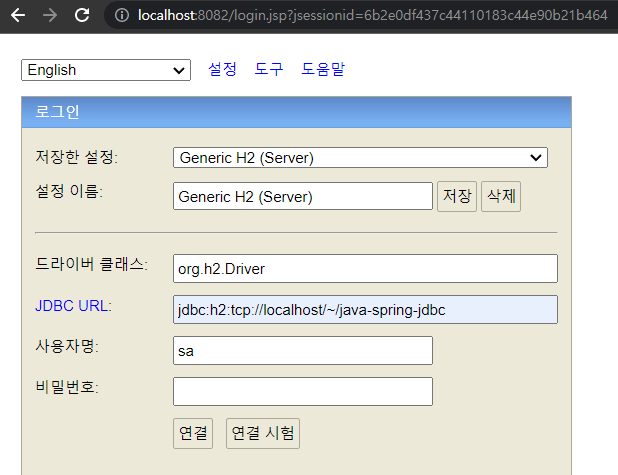

# java-spring-jdbc

우아한형제들 김영한 님의 인프런 강의 '스프링 DB 1편 - 데이터 접근 핵심 원리'을 수강하면서 정리하기 위한 레포지토리

---

## 프로젝트 초기 설정

<details>
<summary>접기/펼치기 버튼</summary>
<div markdown="1">

### start.spring.io

아래의 설정 후 Generate를 클릭 > 압축파일 받아짐 > 풀기 > 인텔리제이에서 해당 폴더의 build.gradle 선택해서 프로젝트 빌드
- Project : Gradle Project
- Language: java
- Spring Boot : 2.6.6 (뒤에 괄호가 붙지 않은 가장 최신 버전을 사용)
- Project Metadata
  - Group
  - Artifact, Name
  - Package name : 자동적으로 `Group.Name`으로 작성됨
  - Packaging : Jar
  - Java : 11

### Dependencies
- Lombok
- JDBC API
- H2 Database : Driver Manager

### build.gradle 설정
```groovy
//테스트에서 lombok 사용
testCompileOnly 'org.projectlombok:lombok'
testAnnotationProcessor 'org.projectlombok:lombok'
```
- Dependencies에 추가 (테스트 코드에서 Logger 사용 목적)
- 인텔리제이 우측 상단의 gradle > Reload All Gradle Projects

### H2 데이터베이스 설치


- [h2 홈페이지](https://www.h2database.com/html/main.html) > All Downloads > Archive Downloads
- 스프링부트에서 지원하는 버전을 확인하고 적절한 버전을 사용
  - 2022.04.12 기준으로 스프링부트에서 지원하는 버전은 1.4.200 [[링크](https://docs.spring.io/spring-boot/docs/current/reference/html/dependency-versions.html#appendix.dependency-versions)]
    - 확인방법 : [Spring 공식 페이지](https://spring.io/) - Projects - [Spring Boot](https://spring.io/projects/spring-boot) - Learn - 현재 버전의 [Reference Doc](https://docs.spring.io/spring-boot/docs/current/reference/html/) > [Dependency Versions](https://docs.spring.io/spring-boot/docs/current/reference/html/dependency-versions.html#appendix.dependency-versions)

### H2 데이터베이스 실행



- 압축을 풀고, `h2>bin` 폴더에 들어간다.
- h2 실행 쉘 스크립트를 실행한다.
  - windows : `.\h2.bat`을 입력하여 실행
  - mac/linux : `chmod 755 h2.sh` 입력하여 권한 부여 후,  `.\h2.sh`을 입력하여 실행
- 주소창의 경로를 `localhost:8082/...` 로 변경하여 접속
- JDBC URL에 `jdbc:h2/~/java-spring-jdbc` 입력하여 연결하면 로컬드라이브에서 `~/java-spring-jdbc.mv.db` 생성됨
  - 여기서 지정한 url로 최초 접속하면 로컬드라이브의 해당 경로의 파일을 생성하고 접근
  - 이후부터는 파일에 직접 접근
- 이후에는 DB 접속시 `jdbc:h2:tcp://localhost/~/java-spring-jdbc`를 통해 접근함.
  - 이후부터는 이 URL로 접근함.

### 테이블 생성
```sql
DROP TABLE member if exists cascade;

CREATE TABLE member (
  member_id varchar(10),
  money integer not null default 0,
  primary key (member_id)
);

insert into member(member_id, money) values('hi1', 10000);
insert into member(member_id, money) values('hi2', 20000);
```

- drop table ...
  - DROP TABLE 테이블명 : 테이블 제거
  - if exists : 해당 테이블이 없어도 오류를 내지 않고, 알림 메시지만 보duwna
  - CASCADE : 해당 테이블과 의존성 관계가 있는 모든 객체들도 함께 삭제한다. 물론, 삭제될 다른 객제와 관계된 또 다른 객체들도 함께 삭제
- 테이블 생성 DDL
- 원활한 테스트를 위해 사용자 2명 초기 추가

---

</div>
</details>

---

